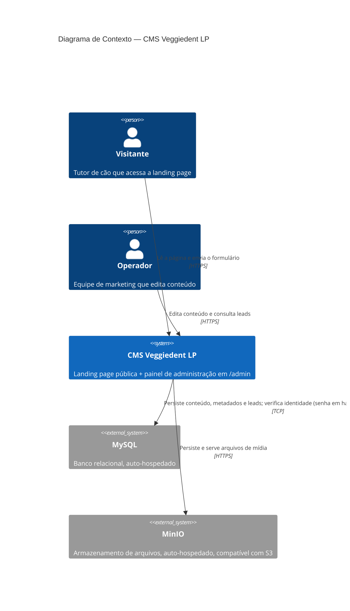
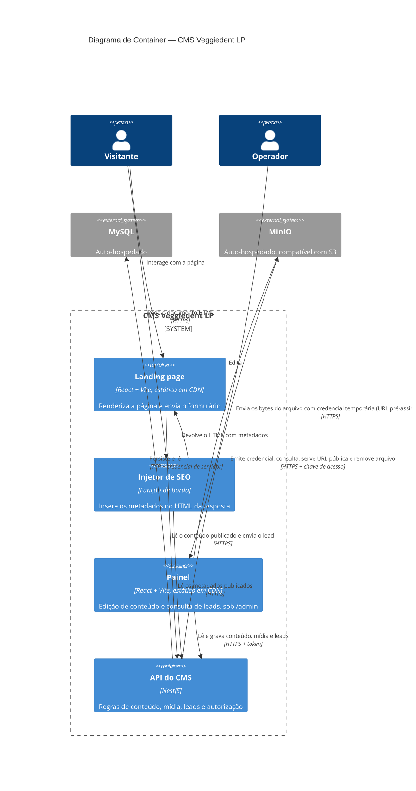

# SDD — CMS Veggiedent LP

Derivado de `agent_context/PRD.md` (aprovado). Nenhuma decisão aqui introduz capacidade que não seja rastreável a uma linha do PRD.

## Linguagem ubíqua

| Termo | Definição |
|---|---|
| **Landing page (LP)** | A página pública do Veggiedent, hoje em `src/`. Único consumidor público do conteúdo. |
| **Painel** | A interface de administração, servida sob `/admin`, usada pelos operadores. |
| **Operador** | Pessoa autenticada que edita conteúdo e consulta leads. Todos os operadores têm o mesmo nível de acesso. |
| **Seção** | Uma das **9** áreas de conteúdo da LP editáveis pelo CMS (`hero`, `educacao`, `rotina`, `produto`, `demonstracao`, `prova_autoridade`, `captura_lead`, `onde_comprar`, `faq`). O conjunto é fechado: o CMS edita seções existentes, nunca cria tipos novos. `header`, `ingredientes` e `footer` **não são seções do CMS** — saíram em 2026-09-04 (T28 e T32): `ingredientes` foi removida do projeto, `header` e `footer` viraram conteúdo fixo em código. |
| **Documento de seção** | O registro único que guarda todo o conteúdo de uma seção, incluindo suas listas. Uma seção ↔ um documento. |
| **Esquema de seção** | A definição declarativa dos campos de uma seção: nome, tipo, rótulo em português, obrigatoriedade. É a fonte única que gera ao mesmo tempo a validação na API, o formulário no painel e os tipos consumidos pela LP. |
| **Item de lista** | Elemento de uma coleção dentro de um documento de seção (um card, um passo, um parceiro, uma pergunta do FAQ, um vídeo, um link). |
| **Mídia** | Arquivo de imagem ou vídeo enviado pelo painel e guardado no armazenamento. Referenciada por identificador, nunca por caminho digitado à mão. Existiu um terceiro tipo, legenda (`caption`), removido do projeto inteiro na T31 (2026-09-04): nunca teve uso real (0 registros na tabela). |
| **Publicação** | O ato de salvar. Não há rascunho: salvar torna o conteúdo visível na LP. |
| **Visibilidade** | Sinalizador que retira uma seção ou um item de lista da LP sem apagar o conteúdo. Substitui os controles hoje em código (`isReadyForProduction`, `isContentReady`, blocos comentados). |
| **Metadados da página** | Título, descrição e imagem de compartilhamento usados por buscadores e previews de link. |
| **Injetor de SEO** | Componente de borda que insere os metadados no HTML antes de a resposta chegar ao navegador. |
| **Instantâneo de conteúdo** | Cópia do conteúdo publicado embutida no build da LP, usada como conteúdo de reserva quando a API está indisponível. |
| **Lead** | Registro de um envio do formulário da LP, com os dados preenchidos pelo visitante. O banco do CMS é o **único** lugar onde ele existe (RD Station descontinuado em 2026-09-03). |

## Porte do projeto

**Médio.**

Sinais concretos do PRD que sustentam a classificação — nenhum deles é preferência de arquitetura:

- **Múltiplos domínios de negócio:** o PRD descreve quatro domínios distintos com regras próprias — conteúdo editorial, mídia, metadados de página e leads (este último com exigência de LGPD que os outros não têm).
- **Integração externa obrigatória:** banco (MySQL), armazenamento de arquivos (MinIO) e autenticação própria são dependências declaradas no PRD, não opcionais — auto-hospedadas desde 2026-09-21 (antes, Supabase cobria as três). *(O RD Station, que também constava aqui, foi descontinuado em 2026-09-03; a classificação de porte não muda, pois os demais sinais bastam.)*
- **Mais de um consumidor:** a LP pública e o painel consomem o mesmo conteúdo por caminhos diferentes, com exigências de segurança opostas (leitura anônima do conteúdo publicado × acesso autenticado a leads).
- **Evolução contínua esperada:** o critério de release exige que "adicionar um campo novo a uma seção existente seja uma tarefa pequena e documentada" — isso é um requisito explícito de manutenibilidade de longo prazo, incompatível com o porte Pequeno (MVP/protótipo).

O porte Pequeno foi descartado por não atender nenhum dos seus critérios: são 12 features (não até ~5), dois consumidores (não um), duas integrações externas obrigatórias (não zero) e vida útil de produção (não curta ou incerta).

**Aplicação proporcional do porte Médio:** adoto DDD apenas como organização de módulos por domínio e Hexagonal apenas na fronteira com serviços externos. Não haverá agregados, objetos de valor, eventos de domínio ou CQRS — o volume declarado no PRD é baixo (dezenas de edições por mês, poucos usuários simultâneos) e o usuário pediu explicitamente "um CMS simples". Rigor além disso seria over-engineering.

## Camadas e padrão arquitetural

### Visão de tiers (processos separados, comunicação por HTTP)

| Tier | Responsabilidade | Tecnologia |
|---|---|---|
| **T1 — LP pública** | Renderiza a landing page no navegador. Lê conteúdo publicado. | React 18 + Vite 5 + TypeScript 5 + Tailwind 3 (o que já existe) |
| **T2 — Injetor de SEO** | Intercepta a requisição do documento HTML, insere os metadados e devolve. | Função de borda da plataforma de CDN |
| **T3 — Painel** | Interface de edição sob `/admin`. | React 18 + Vite 5 + TypeScript 5 |
| **T4 — API do CMS** | Regras de negócio, validação, autorização, repasse de leads. | NestJS 11 (Node 20+) + TypeScript 5 |
| **T5 — Plataforma de dados** | Banco relacional, armazenamento de arquivos, emissão de identidade. | **Revisto em 2026-09-21:** MySQL 8 (auto-hospedado) + MinIO (auto-hospedado, compatível com S3) + autenticação própria na API (antes: Supabase — Postgres + Storage + Auth) |


T1, T2 e T3 são publicados como artefatos estáticos em CDN; T4 é um serviço sempre ativo. **A LP é servida pela CDN, não pela API** — é isso que cumpre o requisito do PRD de que a indisponibilidade do CMS não derrube a página pública.

### Visão de layers dentro da API (T4 — mesmo processo, chamada de método direta)

| Camada | Conteúdo | Conhece |
|---|---|---|
| **Apresentação** | Controllers, DTOs, pipes de validação, guardas de autenticação. Nenhuma regra de negócio. | Aplicação |
| **Aplicação** | Casos de uso: publicar seção, registrar mídia, receber lead, exportar leads. Orquestra domínio e portas. | Domínio, Portas |
| **Domínio** | Esquemas de seção, regras de validação de conteúdo, regras de visibilidade, invariantes do lead. Sem nenhum import de framework ou de infraestrutura de dados. | Nada |
| **Infraestrutura** | Adaptadores que implementam as portas: repositórios MySQL, armazenamento MinIO, emissão/verificação de token próprio. **Revisto em 2026-09-21** — antes: repositórios Supabase, armazenamento Supabase Storage, verificador de token por JWKS do Supabase Auth. | Domínio (implementa suas portas) |

**Padrão arquitetural:** **Hexagonal (Ports & Adapters)**, com módulos NestJS por domínio (`content`, `media`, `leads`, `auth`, `metadata`, `operators`). Justificativa ligada ao porte e ao PRD: o PRD impõe integrações externas obrigatórias e exige que credenciais e acesso a dados fiquem confinados ao servidor; isolar a plataforma de dados e o RD Station atrás de portas é o que permite testar as regras de conteúdo e de lead sem tocar em serviço externo, e é o que torna "adicionar um campo novo" uma mudança de esquema em vez de uma mudança espalhada por camadas. **Expectativa declarada para a troca de Supabase para MySQL/MinIO (2026-09-21):** por esse isolamento já existir, a troca de plataforma de dados deve ficar confinada aos arquivos de `infrastructure/` de cada módulo, sem exigir mudança em caso de uso, controller ou regra de domínio — a Fase 4 verifica se isso se sustenta na prática (ver `PLAN.md` § fase `migracao-mysql`, critério de "pronto" da tarefa `revisao-final`).

**Regra de dependência:** **estrita**. Cada camada só conhece a imediatamente inferior; o Domínio não conhece ninguém. A Infraestrutura depende do Domínio (implementa suas interfaces), nunca o contrário — é o princípio de Inversão de Dependência aplicado no nível de camada, consistente com o DIP exigido no nível de classe. Consequências obrigatórias:

- Nenhum controller contém regra de negócio; controller apenas traduz HTTP em chamada de caso de uso.
- Nenhum acesso ao banco ou ao armazenamento acontece fora da camada de Infraestrutura — nem em controller, nem em caso de uso.
- A LP e o painel nunca falam com o banco para ler ou gravar conteúdo; falam sempre com a API. A única exceção declarada é o **envio dos bytes** de um arquivo direto do navegador para o armazenamento (MinIO), com credencial temporária emitida pela API (justificativa em D-05).

### Ponto único de entrada (exigência da skill 1.5.0)

Este sistema tem **duas aplicações consumidas por usuário final** no mesmo domínio — a landing page e o painel — mais a API que as serve. A skill 1.5.0 passou a exigir que, nesse caso, o SDD declare desde a primeira versão um **ponto único de entrada de desenvolvimento** e como cada aplicação se registra nele, em vez de deixar a costura para o fim da Fase 4.

**Declaração, registrada retroativamente em 2026-09-05:** o desenvolvimento expõe **um endereço só** — `http://localhost:5173` —, com o mesmo mapa de caminhos que a publicação usa: `/` serve a LP, `/admin` serve o painel, `/api/*` alcança a API. Os três processos existem por trás, mas nenhum é acessado por porta própria. O servidor de desenvolvimento da LP é o ponto de entrada e encaminha `/admin` e `/api`; `npm run dev` na raiz sobe os três.

**Por que isso é regra e não conveniência:** o mapa de caminhos é a parte que o usuário enxerga e a que mais facilmente quebra. Servindo cada aplicação em sua própria porta durante o desenvolvimento, o roteamento só seria exercitado na tarefa de publicação — a última. Neste projeto isso já custou um defeito real: `/admin` sem barra final devolvia 404, e só apareceu ao acessar pelo endereço de verdade, com a suíte inteira verde.

**Dívida registrada:** esta declaração deveria ter existido na primeira versão do SDD. Ela foi construída tarde, na tarefa `fundacao/entrada-unica` (T20), depois de o usuário apontar que lidava com três endereços diferentes. Ver `agent_context/CHANGELOG.md`, entrada de 2026-09-03.

### Estrutura de pastas do repositório

O usuário confirmou repositório único com pastas separadas. O repositório passa a ser um monorepo de workspaces:

```
/
├── apps/
│   ├── lp/                 # a landing page atual, movida da raiz
│   ├── admin/              # painel servido em /admin
│   └── api/                # API NestJS
├── packages/
│   └── content-schema/     # esquemas de seção + tipos, compartilhados pelos três apps
├── agent_context/          # documentos de processo (raiz, cobre o produto inteiro)
└── README.md               # documentação técnica (raiz, cobre o produto inteiro)
```

`agent_context/` e `README.md` permanecem na raiz e cobrem o produto inteiro: apesar da estrutura de monorepo, isto é **um** produto com **um** PRD, não sub-projetos independentes. Não haverá `agent_context/` por app.

### Modelo de dados

**Revisto em 2026-09-21:** cinco tabelas em MySQL 8 (antes: quatro tabelas em Postgres/Supabase — a quinta, `operators`, nasce da D-03/D-09 revisadas). Tradução de tipo Postgres → MySQL usada nas quatro tabelas originais: `uuid` → `CHAR(36)` (UUID gerado na aplicação, não no banco — MySQL não tem gerador nativo de UUID v4 portável); `jsonb` → `JSON` (MySQL 8 tem tipo `JSON` nativo, com o mesmo papel de guardar o documento validado pelo esquema da aplicação — D-01 não muda); `text` → `VARCHAR` com tamanho declarado onde há limite conhecido, ou `TEXT` onde não há; `timestamptz` → `DATETIME(3)`, sempre gravado em UTC pela aplicação (MySQL `DATETIME` não guarda fuso; a conversão para horário de Brasília, já feita hoje para o filtro de leads — ver `brasilia-time.ts` — passa a partir da premissa de que todo valor lido do banco já é UTC, nunca do fuso da sessão do MySQL); `boolean` → `TINYINT(1)` (convenção padrão do MySQL para booleano).

**`content_sections`** — um registro por seção. Todo o conteúdo da seção, incluindo suas listas, vive em `data`.

| Coluna | Tipo (MySQL) | Nota |
|---|---|---|
| `key` | `VARCHAR(64)` PK | Um dos 9 identificadores fechados de seção |
| `data` | `JSON` | Conteúdo validado contra o esquema da seção |
| `is_published` | `TINYINT(1)` | Visibilidade da seção inteira |
| `updated_at` | `DATETIME(3)` | UTC |
| `updated_by` | `CHAR(36)` | Operador que salvou |

**`site_metadata`** — registro único (`id` fixo) com `title`, `description`, `og_image_media_id`, `og_image_alt`, `updated_at`, `updated_by`. **Correção de retomada em 2026-09-21:** esta linha estava desatualizada desde a T25 (2026-09-05) — carregava `canonical_url`, removido naquela migração (`20260905120000_remove_canonical_url_and_option_codes.sql`, o endereço canônico voltou a ser estático em `apps/lp/index.html`), e não citava `og_image_alt`, adicionado antes disso (`20260902130000_add_og_image_alt_to_site_metadata.sql`). Conferido contra `supabase-site-metadata.repository.ts`, que é quem de fato lê/grava essas colunas hoje — nenhuma tarefa de código precisa mudar por causa desta correção, só a descrição estava errada.

**`media_assets`** — um registro por arquivo enviado.

| Coluna | Tipo (MySQL) | Nota |
|---|---|---|
| `id` | `CHAR(36)` PK | UUID gerado na aplicação. Referenciado pelos documentos de seção |
| `kind` | `VARCHAR(16)` | `image` \| `video` |
| `storage_path` | `VARCHAR(512)` | Caminho no bucket MinIO |
| `public_url` | `VARCHAR(1024)` | URL pública servida ao navegador |
| `mime_type`, `size_bytes`, `original_filename` | | |
| `width`, `height`, `duration_seconds` | nulos conforme o tipo | |
| `created_at`, `created_by` | | |

**`leads`** — um registro por envio do formulário.

| Coluna | Tipo (MySQL) | Nota |
|---|---|---|
| `id` | `CHAR(36)` PK | UUID gerado na aplicação |
| `nome`, `email` | `VARCHAR(255)` | Obrigatórios |
| `telefone`, `nome_cachorro`, `porte_cachorro`, `cidade_estado` | `VARCHAR(255)` | Opcionais |
| `conhece_virbac`, `usa_produto_virbac`, `qual_produto_virbac` | `VARCHAR(255)` | Opcionais — hoje coletados e descartados (ver R-01) |
| `aceite_comunicacoes` | `TINYINT(1)` | Opt-in de marketing. Varia de verdade entre `true` e `false`, por isso é guardado |
| `origem` | `VARCHAR(64)` | |
| `created_at` | `DATETIME(3)` | UTC |

**Por que não existe coluna `aceite_lgpd`.** O consentimento com a Política de Privacidade é **condição de envio**: sem ele o formulário é recusado com `422` e nenhum registro nasce. Guardar a coluna significaria gravar a constante `true` em toda linha — informação zero, e uma coluna inútil na exportação. A prova de consentimento é a própria existência do registro somada a `created_at`. Se um dia for preciso provar **a que texto** a pessoa consentiu (por exemplo, depois de a Política de Privacidade mudar), o campo correto a criar é a versão do texto aceito, não um booleano que só pode ser verdadeiro. Ver `agent_context/CHANGELOG.md`, entrada de 2026-09-02 sobre este erro de modelagem.

**`operators`** — nova tabela (D-03/D-09 revisadas em 2026-09-21). Um registro por conta de operador do painel.

| Coluna | Tipo (MySQL) | Nota |
|---|---|---|
| `id` | `CHAR(36)` PK | UUID gerado na aplicação |
| `email` | `VARCHAR(255)` UNIQUE | Login |
| `password_hash` | `VARCHAR(255)` | Hash argon2id — nunca a senha em texto puro, nunca lido fora do módulo `auth`/`operators` |
| `name` | `VARCHAR(255)` | Exibido no painel. Antes vivia em `user_metadata` do Supabase Auth por não haver tabela própria; agora tem coluna própria, já que a tabela é da aplicação |
| `created_at` | `DATETIME(3)` | UTC |

**Isolamento de acesso (revisto em 2026-09-21):** MySQL não tem um equivalente de Row Level Security do Postgres. A garantia de isolamento da superfície pública do PRD passa a vir inteiramente da arquitetura, não de um recurso do banco: a aplicação conecta ao MySQL com uma única credencial de servidor, nunca exposta ao navegador (mesma garantia de antes, R-09 revisado abaixo); nenhum cliente (LP, painel) tem endereço, porta ou credencial do MySQL; todo acesso passa pela API. Isso é estritamente equivalente, na prática, ao que a RLS "sem nenhuma policy permissiva" já garantia — o Supabase também nunca expunha o banco a um cliente sem passar pela API desta aplicação; a política de RLS era uma segunda camada de defesa contra um vazamento de credencial que, por não existir mais um serviço externo com chave própria, deixa de ter o mesmo cenário de risco (ver R-09).

## Diagrama de arquitetura

### Contexto



*(Revisto em 2026-09-21 — antes: um único `System_Ext(supabase, ...)` cobria banco, armazenamento e identidade.)*

### Containers



*(Revisto em 2026-09-21 — antes: o painel autenticava direto no Supabase Auth, `System_Ext(supabase, ...)` único cobria as três funções.)*

## Decisões técnicas e trade-offs

### D-01 — Um documento por seção em coluna `JSON`, validado por esquema declarativo

**Escolhido:** cada seção é um registro com o conteúdo inteiro em uma coluna `JSON` (revisto em 2026-09-21: `jsonb` era o tipo do Postgres/Supabase; `JSON` é o tipo nativo equivalente do MySQL 8 — a decisão em si não muda, só o banco que a hospeda), validado contra um esquema declarado em `packages/content-schema`.

**Alternativas:** (a) uma tabela por seção, com colunas tipadas; (b) modelo entidade-atributo-valor genérico.

**Por quê:** (a) transformaria cada mudança de campo numa migração de banco, violando o critério de release "adicionar um campo novo é uma tarefa pequena"; (b) tornaria toda leitura uma reconstrução cara e ilegível, e é a porta de entrada clássica para consultas N+1. O modelo escolhido lê a página inteira em uma única consulta.

**Trade-off aceito:** o banco não garante a forma do conteúdo — a garantia vem do esquema na aplicação. Mitigado por validação obrigatória na escrita (nenhum caminho de gravação escapa do esquema) e por R-03.

### D-02 — O esquema de seção é a fonte única de validação, formulário e tipos

**Escolhido:** um pacote compartilhado (`packages/content-schema`) declara, por seção, os campos com tipo, rótulo em português, texto de ajuda e obrigatoriedade. A API valida contra ele, o painel **gera o formulário** a partir dele, e a LP importa os tipos dele.

**Alternativas:** formulários escritos à mão por seção, com validação duplicada na API.

**Por quê:** o PRD exige rótulos na linguagem de quem escreve conteúdo e que cada campo deixe claro onde aparece na página — isso é metadado do campo, e mantê-lo em um só lugar evita que painel e API divirjam. Também é o que torna "adicionar um campo novo" uma edição de um arquivo em vez de três.

**Trade-off aceito:** formulário gerado dá menos liberdade de layout que um formulário escrito à mão. Aceitável para uma ferramenta interna, onde o PRD prioriza clareza sobre sofisticação visual.

### D-03 — Autenticação própria no NestJS, com senha em hash e JWT assinado pela aplicação *(reescrita em 2026-09-21)*

> **Desenho original, superado em 2026-09-21:** o painel autenticava direto no Supabase Auth (e-mail e senha) e recebia um JWT; a API validava esse JWT contra o JWKS público do projeto Supabase. Superado pela troca de plataforma de dados (ver `agent_context/CHANGELOG.md`, entrada de 2026-09-21) — não havia mais um provedor de identidade externo para emitir e verificar o token.

**Escolhido:** a API ganha um endpoint de login (`POST /api/auth/login`) que recebe e-mail e senha, busca o operador na tabela `operators` (MySQL) pelo e-mail, verifica a senha com **argon2id** contra `password_hash`, e — se válida — assina um JWT com um segredo simétrico próprio da aplicação (`AUTH_JWT_SECRET`, variável de ambiente, nunca no repositório) usando `jose` (já era dependência, antes só para verificar; passa também a assinar). O painel guarda esse token e o envia em `Authorization: Bearer` a cada requisição, exatamente como antes. A guarda global do NestJS passa a verificar a assinatura com o mesmo segredo simétrico, em vez de buscar chave pública por JWKS.

**Alternativas:** (a) manter um provedor de identidade externo auto-hospedado (ex.: Keycloak) — descartada por decisão do usuário (ver pergunta de esclarecimento antes desta mudança): adiciona um serviço a mais na infraestrutura sem necessidade, para uma equipe pequena com um único nível de acesso; (b) sessão por cookie assinado pela API em vez de JWT no header — descartada por exigir mudar o contrato entre painel e API sem ganho: o painel já é um SPA que já guarda e envia o token manualmente, e as duas aplicações (LP e painel) já esperam chamadas `fetch` com header, não cookie de mesma origem gerenciado pelo navegador.

**Por quê:** com o Supabase fora do projeto, alguém precisa assumir a responsabilidade de guardar e verificar senha — não há mais um provedor gerenciado para isso. `argon2id` é o algoritmo de hash de senha recomendado atualmente (OWASP) e não exige serviço externo. Manter JWT como formato de token preserva o contrato já existente entre painel e API (`Authorization: Bearer <token>`), então nenhuma tela do painel muda de forma além de onde o login é chamado.

**Trade-off aceito:** a aplicação passa a ser responsável por um segredo de assinatura (`AUTH_JWT_SECRET`) que, se vazar, permite forjar qualquer sessão de operador — antes esse risco não existia porque a API só verificava (chave pública, sem segredo). Mitigado por: o segredo nunca é uma variável `VITE_*` (não entra em nenhum build de navegador — mesma regra de isolamento já aplicada à antiga chave secreta do Supabase, ver R-09 revisado); documentado como obrigatório de gerar aleatoriamente por ambiente (nunca reaproveitado entre desenvolvimento e produção); sem endpoint de rotação automática nesta versão — trocar o segredo desloga todos os operadores de uma vez, aceitável para uma ferramenta interna de equipe pequena (mesma proporcionalidade já usada em D-09).

**Sessão sem estado no servidor, herdada do desenho original:** como antes, não há lista de tokens revogados nem sessão guardada no banco — o JWT é auto-contido e stateless. "Logout" continua sendo o painel descartar o token guardado no navegador; um token já emitido continua válido até expirar mesmo após logout, exatamente o mesmo comportamento que já existia com o Supabase Auth (o PRD não exige revogação imediata de sessão).

**O que continua valendo do PRD e de D-09, sem mudança:** **todos os operadores têm o mesmo nível de acesso**, sem papéis nem permissões diferenciadas.

**Consequência de segurança:** a guarda é global e nega por padrão. Um endpoint só é público se alguém o marcar explicitamente — o esquecimento leva a "bloqueado", nunca a "exposto". Isso não muda com a troca de verificação por JWKS para verificação por segredo simétrico.

### D-04 — Tudo sob `/admin` é servido como aplicação separada, sem rota pública

**Escolhido:** o painel é um build próprio, publicado sob `/admin`, com verificação de sessão antes de renderizar qualquer tela. Os endpoints administrativos ficam sob `/api/admin/*`, todos atrás da guarda.

**Por quê:** o PRD exige que nenhum endereço sob `/admin` seja alcançável sem sessão. Separar o build também impede que código do painel entre no pacote da LP, o que aumentaria o peso da página pública.

**Trade-off aceito:** dois builds em vez de um. Compensado por não penalizar a performance da LP, que é requisito do PRD.

### D-05 — Bytes de arquivo vão direto do navegador para o armazenamento *(reescrita em 2026-09-21)*

> **Desenho original, superado em 2026-09-21:** o armazenamento era o Supabase Storage, com upload retomável em blocos pelo protocolo TUS. Superado pela troca para MinIO auto-hospedado (ver `agent_context/CHANGELOG.md`, entrada de 2026-09-21).

**Escolhido:** o painel pede à API uma credencial temporária de upload; a API a emite — agora como uma **URL PUT pré-assinada do MinIO** (protocolo S3, gerada com as credenciais de acesso do servidor, escopada a um bucket e caminho específicos, com validade curta) — e devolve; o navegador envia o arquivo **direto ao MinIO** com uma requisição `PUT` para essa URL; ao concluir, o painel confirma à API, que registra a mídia. O três-passos (pedir credencial → enviar bytes → confirmar) não muda.

**Alternativas:** (a) o arquivo trafegar pela API — descartada pelo mesmo motivo original (abaixo); (b) reproduzir upload retomável em blocos (multipart do protocolo S3, que o MinIO também suporta) — descartada nesta troca: o limite de arquivo do projeto é 50 MB (premissa do PRD), porte para o qual um `PUT` único e simples é confiável em qualquer conexão razoável, e a complexidade de orquestrar upload multipart (iniciar, enviar cada parte, completar) não se paga para esse tamanho de arquivo — decisão proporcional ao porte Médio do projeto.

**Por quê (arquivo direto ao armazenamento, herdado do desenho original):** o PRD declara vídeos na ordem de dezenas a centenas de MB. Passar isso pela API significaria tempo de requisição longo, consumo de memória e esbarro nos limites de corpo de requisição de qualquer plataforma.

**Trade-off aceito:** o fluxo tem três passos em vez de um, e um upload interrompido pode deixar um arquivo no armazenamento sem registro correspondente. Mitigado em R-04 (sem mudança). A chave de acesso do MinIO continua exclusivamente no servidor — o navegador recebe apenas uma URL pré-assinada de escopo e validade limitados, o que preserva o requisito de isolamento do PRD.

**Trade-off novo, específico desta troca:** ao abandonar o upload retomável em blocos, uma falha de rede a 90% de um vídeo de 50 MB exige reenviar o arquivo inteiro, não retomar do ponto de interrupção. Aceito porque (i) o teto de 50 MB já era conhecido e pequeno o bastante para um reenvio completo ser tolerável, e (ii) o painel continua mostrando progresso do envio ao operador (evento de progresso do `XMLHttpRequest`/`fetch` com `ReadableStream`, do lado do navegador) — o operador não fica sem retorno visual, só perde a retomada por bloco. Se o volume de vídeo do projeto crescer muito além de 50 MB no futuro, revisitar esta decisão (multipart do MinIO) antes de simplesmente subir o teto.

### D-06 — Metadados injetados na borda, com o HTML estático como reserva

**Escolhido:** uma função de borda intercepta a requisição do documento, busca os metadados publicados na API (com cache curto), injeta no HTML estático e devolve. Se a API falhar ou demorar, devolve o HTML estático **sem alteração**, com os metadados padrão que já estão em `index.html`.

**Alternativas:** (a) reescrever o HTML publicado a cada publicação; (b) migrar a LP para renderização no servidor; (c) aplicar os metadados no navegador.

**Por quê:** (c) não é enxergado pelos previews de link, que não executam JavaScript — foi descartado na revisão do PRD. (b) está explicitamente fora de escopo. (a) esbarra na imutabilidade do deploy das plataformas de CDN e exigiria reconstrução, incompatível com publicação instantânea.

**Trade-off aceito:** acrescenta um salto na entrega do documento. Mitigado pelo cache curto e pela reserva, que garante que a página nunca deixa de ser servida por causa do CMS.

**Isolamento de plataforma:** a implementação específica da CDN fica em um único arquivo. Trocar de provedor é reescrever esse arquivo, não redesenhar o sistema.

### D-07 — O repasse ao RD Station migra da função serverless para a API *(DECISÃO HISTÓRICA — superada)*

> **Superada em 2026-09-03:** o usuário descontinuou o RD Station. O repasse deixou de existir em qualquer lugar, e `POST /api/leads` apenas valida e grava. O texto abaixo fica como registro de por que a função serverless foi aposentada. Ver `agent_context/CHANGELOG.md`.

**Escolhido:** `POST /api/leads` passa a ser o único endpoint do formulário: valida, grava o lead e repassa ao RD Station. A função em `serverless/rdstation-lead/` é aposentada, com sua lógica de validação, honeypot e mapeamento de campos preservada dentro de um adaptador da camada de Infraestrutura.

**Alternativas:** manter a função serverless e fazê-la também gravar no banco.

**Por quê:** manteria duas credenciais, dois deploys e duas cópias da mesma validação, para o mesmo fluxo. O PRD exige que o lead seja gravado mesmo quando o RD Station falha — regra de negócio que pertence a um caso de uso, não a um relay.

**Trade-off aceito:** o envio do lead passa a depender da API, que a LP de resto só usa para leitura. Mitigado em R-02.

**Desvio do PRD registrado:** o PRD diz que o repasse continua "através da integração serverless que já existe no projeto". Esta decisão substitui o mecanismo, preservando o comportamento externo. Registrado em `agent_context/CHANGELOG.md`.

### D-08 — Instantâneo de conteúdo embutido no build da LP

**Escolhido:** o build da LP embute um instantâneo do conteúdo publicado. Em tempo de execução a LP busca o conteúdo na API; se a busca falhar, renderiza o instantâneo.

**Alternativas:** (a) mostrar estado vazio ou de erro; (b) cachear no navegador do visitante.

**Por quê:** o PRD exige que a indisponibilidade do CMS não deixe a página quebrada ou vazia. (a) viola isso diretamente; (b) não protege o primeiro acesso, que é o caso mais comum numa página de campanha.

**Trade-off aceito:** o instantâneo envelhece entre builds, então uma falha prolongada da API pode exibir conteúdo defasado. Preferível a exibir nada, e a defasagem é visível apenas durante indisponibilidade.

### D-09 — Gestão de operadores dentro do painel, sobre a tabela `operators` própria *(reescrita em 2026-09-21)*

> **Desenho original, superado em 2026-09-21:** a API falava com a **Admin API** do Supabase Auth (`auth.admin.*`) usando a chave secreta para criar, listar e remover operadores; o nome do operador vivia em `user_metadata`, por não existir tabela própria. Superado pela troca de plataforma de dados (ver `agent_context/CHANGELOG.md`, entrada de 2026-09-21) — sem Supabase Auth, não há mais Admin API para chamar.

**Escolhido:** o painel mantém a mesma tela para listar, criar e remover operadores. A API expõe `/api/admin/operators/*`, atrás da mesma guarda global (D-03), e passa a ler e escrever diretamente na tabela `operators` (MySQL, ver "Modelo de dados"). Criar um operador grava um novo registro com `password_hash` calculado por argon2id (mesmo algoritmo e módulo de D-03); remover um operador apaga o registro (`DELETE`, não soft-delete — o PRD não exige histórico de operadores removidos).

**Criação de operador — sem mudança de fluxo desde a T34 (2026-09-04):** quem cria preenche e-mail, senha e nome do operador novo diretamente na tela; a conta já nasce pronta para uso, sem link nem e-mail. Diferença puramente de implementação: antes a API chamava `admin.createUser(...)`, agora ela mesma faz o hash da senha e insere a linha em `operators` — o comportamento visível ao operador que cria não muda.

**Bootstrap do primeiro operador (novo problema, introduzido por esta troca):** com o Supabase, o primeiro operador de um ambiente novo nascia por um passo manual no painel do Supabase (documentado como a "armadilha" central de `docs/MIGRAR-PARA-NOVO-SUPABASE.md` — "sem o primeiro operador, ninguém entra no painel novo"). Sem Supabase, esse painel de terceiro não existe mais. **Escolhido:** um script de linha de comando (`npm run seed:operator`, mesmo padrão de `migrate:content` já existente em `apps/api`) que recebe e-mail, senha e nome por variável de ambiente ou prompt, e insere o operador direto na tabela `operators` — para ser rodado uma vez por ambiente novo (desenvolvimento, homologação, produção), antes do primeiro login. Documentado em `docs/OPERACAO.md` como o novo passo equivalente ao antigo "criar o primeiro usuário no painel do Supabase".

**Trade-off aceito, herdado sem mudança:** com criação direta, **quem cria sabe a senha inicial de outra pessoa**. O usuário já havia decidido que a simplicidade operacional vale mais que essa garantia neste projeto (equipe pequena, todos os operadores já se conhecem e confiam) — ver decisão original de 2026-09-04. Mitigação parcial, não implementada por não ter sido pedida: nada impede um operador de trocar a própria senha depois (endpoint de troca de senha não existe hoje nem existia com o Supabase — fora de escopo, mesma decisão de antes).

**Consequências de segurança, inegociáveis:**
- O segredo de assinatura JWT (`AUTH_JWT_SECRET`) e a credencial de conexão do MySQL nunca saem do servidor; nenhuma rota nova as expõe ao navegador (mesma regra que antes protegia `SUPABASE_SECRET_KEY`).
- Um operador **não pode remover a si mesmo** nem **remover o último operador restante** — as duas coisas travariam o painel sem ninguém para reabri-lo. Recusado com `409`. Sem mudança nesta troca.

### D-10 — Prisma como ORM e ferramenta de migração do MySQL *(nova em 2026-09-21)*

**Escolhido:** `@prisma/client` para consultas e `prisma migrate` para versionar o schema do MySQL (`content_sections`, `site_metadata`, `media_assets`, `leads`, `operators`). Um único `schema.prisma`, migrações geradas e versionadas em `apps/api/prisma/migrations/`, aplicadas por um comando de servidor dedicado — `npm run migrate:db` (`prisma migrate deploy`) — rodado à parte, contra o `mysql` do compose, nunca automaticamente na subida do contêiner. **Correção de retomada em 2026-09-21:** a primeira versão desta decisão dizia "aplicadas com `prisma migrate deploy` na subida do contêiner", descrito como "mesmo espírito do `supabase db push` que já existia" — mas o `supabase db push` **nunca rodava na subida do contêiner** (`docs/DOCKER.md` já documentava isso: "as migrações não rodam sozinhas; a imagem não aplica nada ao banco"). A comparação estava errada, não só a redação: o desenho real sempre foi um passo manual e separado, e `migrate:db` mantém exatamente essa paridade — automatizar a aplicação no boot do contêiner seria uma exigência nova, sem pedido do PRD, incompatível com a proporcionalidade do porte Médio (exigiria script de entrypoint, inclusão do CLI do Prisma na imagem de produção, e tratamento de corrida entre réplicas — nenhum desses problemas existe hoje).

**Alternativas:** (a) `mysql2` cru, sem camada de ORM — o projeto já não usava um ORM pesado sobre o Supabase (usava o query builder do `@supabase/supabase-js`, equivalente em nível de abstração); (b) TypeORM — integração "oficial" com NestJS via `@nestjs/typeorm`, mas com padrões ativamente desaconselhados pela própria comunidade (Active Record misturado com Data Mapper, migrações menos previsíveis); (c) Kysely — query builder tipado sem geração de código, mais leve que Prisma.

**Por quê:** o porte Médio do projeto e a exigência do PRD de que "adicionar um campo novo a uma seção existente é uma tarefa pequena e documentada" pedem uma ferramenta com migração de schema declarativa e gerada automaticamente a partir do modelo — Prisma cobre isso de forma mais direta que `mysql2` cru (que exigiria escrever e manter SQL de migração à mão) e de forma mais madura que Kysely (sem geração de migração embutida). Frente a TypeORM, Prisma tem tipagem gerada mais estrita e um fluxo de migração mais prático de auditar em revisão de PR (cada migração é um arquivo `.sql` gerado, legível no diff).

**Trade-off aceito:** mais uma ferramenta de geração de código no pipeline de build (`prisma generate`, análogo ao `npm run build --prefix packages/content-schema` que já existe como pre-step); acopla o schema de dados a um formato proprietário do Prisma em vez de SQL puro — mitigado por Prisma gerar SQL padrão auditável a cada migração, sem trava real de saída (é possível ler/exportar o SQL gerado a qualquer momento).

Todos os corpos são JSON em UTF-8. Erros seguem um formato único:

```json
{ "statusCode": 422, "error": "Dados invalidos.", "fields": { "hero.headline": "Campo obrigatorio." } }
```

### Endpoints públicos (sem autenticação)

| Método e rota | Descrição | Resposta |
|---|---|---|
| `GET /api/content` | Todo o conteúdo publicado, em uma resposta. Seções e itens não publicados são omitidos. | `{ sections: Record<SectionKey, SectionData>, metadata: SiteMetadata }` |
| `GET /api/seo` | Só os metadados. Consumido pelo injetor de SEO. | `{ title, description, ogImageUrl, canonicalUrl }` |
| `POST /api/leads` | Recebe o formulário: valida e grava. | `200 { success: true }` · `422` com `fields` · `200 { success: true }` também quando o honeypot é acionado, sem gravar nem repassar |

`POST /api/leads` grava o lead **antes** de tentar o RD Station e responde sucesso se a gravação deu certo, registrando o resultado do repasse em `rdstation_status`. Uma falha do RD Station nunca faz o visitante ver erro nem faz o lead ser perdido.

### Endpoint de login (público, credenciais no corpo)

| Método e rota | Descrição | Resposta |
|---|---|---|
| `POST /api/auth/login` | **Novo em 2026-09-21 (D-03).** Recebe `{ email, password }`; verifica contra `operators` (MySQL) com argon2id. | `200 { accessToken, expiresInSeconds }` · `401` (mesma mensagem genérica para e-mail inexistente ou senha errada — nunca revela qual dos dois falhou, ver C-02) |

### Endpoints administrativos (exigem token válido)

| Método e rota | Descrição |
|---|---|
| `GET /api/admin/sections` | Lista as seções com estado de publicação e data da última edição |
| `GET /api/admin/sections/:key` | Documento completo de uma seção, publicado ou não |
| `PUT /api/admin/sections/:key` | Substitui o documento. Valida contra o esquema; rejeita com `422` e erros por campo. Salvar publica |
| `PATCH /api/admin/sections/:key/visibility` | Liga ou desliga a seção |
| `GET /api/admin/metadata` · `PUT /api/admin/metadata` | Lê e grava os metadados da página |
| `POST /api/admin/media/upload-url` | Recebe nome, tipo e tamanho; devolve credencial temporária e caminho de destino. **Revisto em 2026-09-21 (D-05):** resposta muda de `{ signedUrl, token, resumableEndpoint, expiresInSeconds }` (TUS/Supabase) para `{ uploadUrl, expiresInSeconds }` — uma única URL `PUT` pré-assinada do MinIO |
| `POST /api/admin/media` | Confirma o upload e registra a mídia; devolve o registro com a URL pública |
| `GET /api/admin/media/:id` · `DELETE /api/admin/media/:id` | Consulta e remoção. A remoção é recusada com `409` se a mídia estiver referenciada por alguma seção |
| `GET /api/admin/operators` | Lista os operadores (e-mail, criado em) |
| `POST /api/admin/operators` | Recebe e-mail, senha e nome; cria a conta pronta para uso gravando direto em `operators` com senha em hash (D-09, revisado — antes via Admin API do Supabase) |
| `DELETE /api/admin/operators/:id` | Remove um operador. Recusado com `409` se for o próprio operador autenticado, ou o último operador restante |
| `GET /api/admin/leads` | Lista paginada, mais recente primeiro. Filtros `from` e `to` por data |
| `GET /api/admin/leads/export` | Exportação em CSV com separador `;` e BOM UTF-8, respeitando os filtros |
| `DELETE /api/admin/leads/:id` | Exclusão definitiva de um lead, para pedido do titular |

### Contrato do esquema de seção

Cada seção declara seus campos com esta forma:

```ts
type FieldType =
  | 'texto-curto' | 'texto-longo' | 'lista-de-textos'
  | 'imagem' | 'video' | 'link' | 'booleano'

interface FieldSpec {
  name: string
  type: FieldType
  label: string        // rótulo em português, na linguagem de conteúdo
  help?: string        // onde este campo aparece na página
  required: boolean
}

interface ListSpec {
  name: string
  label: string
  itemFields: FieldSpec[]
  reorderable: true
  minItems?: number
}

interface SectionSchema {
  key: SectionKey
  label: string
  fields: FieldSpec[]
  lists: ListSpec[]
}
```

Regras invariantes do esquema, verificáveis:

- Todo campo `imagem` obriga uma **escolha consciente** entre duas alternativas, nunca um campo em branco por descuido:
  - **imagem informativa** — texto alternativo adjacente e obrigatório, descrevendo o que a imagem comunica; ou
  - **imagem decorativa** — declarada como tal, com texto alternativo vazio e escondida de leitores de tela.

  A segunda alternativa não é uma exceção à acessibilidade: é o tratamento **correto** para imagem que não carrega informação. Descrever uma imagem decorativa é pior do que não descrevê-la, porque injeta ruído no leitor de tela sem acrescentar significado. O caso real que revelou isso é o mosaico ao lado do formulário, hoje marcado com `aria-hidden` e `alt=""` no código. Ver `agent_context/CHANGELOG.md`, entrada de 2026-09-03 sobre a invariante de texto alternativo.
- Todo item de lista carrega um campo de visibilidade e uma posição de ordenação.
- Referências de mídia guardam o identificador da mídia, nunca uma URL digitada.

### Contrato do injetor de SEO

Entrada: requisição do documento HTML. Saída: o mesmo HTML com `<title>`, `meta[name=description]`, `og:title`, `og:description`, `og:image` e `link[rel=canonical]` substituídos pelos valores de `GET /api/seo`. Em qualquer erro ou expiração do tempo limite, devolve o HTML original intacto. O tempo limite é curto o bastante para não ser perceptível pelo visitante.

## Critérios de aceitação por capacidade

Régua usada na Fase 4 para detectar divergência entre o implementado e o pretendido.

| # | Capacidade (PRD) | Critérios de aceitação |
|---|---|---|
| **C-01** | Painel restrito em `/admin` | Requisição a qualquer rota sob `/admin` sem sessão válida leva ao login e não renderiza tela de edição. Requisição a qualquer `/api/admin/*` sem token, ou com token inválido ou expirado, responde `401`. Um endpoint administrativo novo, criado sem marcação, nasce protegido. |
| **C-02** | Autenticação de equipe | Login com credenciais válidas dá acesso; com inválidas, recusa sem revelar se o e-mail existe. A sessão sobrevive a recarregar a página. Logout invalida o acesso. Dois operadores distintos conseguem entrar com suas próprias credenciais. |
| **C-03** | Edição por seção | O painel lista exatamente as 12 seções, na ordem da página, com data da última edição. Abrir uma seção mostra seus campos reais conforme o esquema. |
| **C-04** | Edição de campos de texto | Todo texto hoje presente nos 12 arquivos `*.content.ts` é editável pelo painel, incluindo textos alternativos, rótulos de botão, mensagens de erro do formulário e textos do modal de sucesso. Acentuação é preservada na ida e na volta. Salvar um campo obrigatório vazio é recusado com mensagem por campo. |
| **C-05** | Gestão de itens de lista | Em cada uma das listas (navegação, cards de educação, passos da rotina, textos e benefícios do produto, vídeos, números da prova, parceiros, perguntas do FAQ, links do rodapé) é possível adicionar, editar, remover e reordenar; a ordem definida no painel é a ordem exibida na LP. |
| **C-06** | Upload de imagens | Enviar uma imagem pelo painel a exibe na LP após salvar. O texto alternativo é obrigatório e acompanha a imagem. Arquivo de tipo não suportado é recusado com mensagem clara. |
| **C-07** | Upload de vídeos | Um vídeo de porte equivalente aos existentes no projeto é enviado com sucesso, com progresso visível, e passa a ser reproduzido na LP. **Não existe campo de miniatura**: a imagem exibida antes do carregamento vem do primeiro quadro do próprio arquivo, derivada automaticamente — pedir uma "imagem de pré-carregamento" a um operador leigo é pedir um dado que ele não tem como entender (decisão do usuário em 2026-09-03, ver `agent_context/CHANGELOG.md`). Os bytes do arquivo não passam pela API. |
| **C-08** | Visibilidade | Desligar uma seção a remove da LP sem apagar o conteúdo; religar a traz de volta idêntica. O mesmo vale para um item de lista. Nenhum texto de espaço reservado chega ao visitante. |
| **C-09** | Metadados de busca e compartilhamento | Após alterar o título no painel, buscar o HTML da LP **sem executar JavaScript** já traz o novo título. Com a API indisponível, o mesmo pedido devolve a página com os metadados padrão, nunca um erro. |
| **C-10** | Consumo do conteúdo pela LP | Nenhuma seção importa de `*.content.ts`; todas leem da API. A página não apresenta mudança visual perceptível em relação ao estado atual. Com a API indisponível, a LP renderiza o instantâneo em vez de tela vazia ou quebrada. |
| **C-11** | Registro dos leads | Um envio do formulário cria um registro com todos os campos preenchidos, inclusive os três que hoje são descartados em produção (R-01). O honeypot preenchido não gera registro. **O banco do CMS é o único lugar onde o lead existe** — não há destino externo desde que o RD Station foi descontinuado (2026-09-03), o que torna a gravação a única barreira entre o envio e a perda do dado. |
| **C-12** | Consulta e exportação de leads | A tela lista do mais recente ao mais antigo, com filtro por período, recortando o dia em **horário de Brasília (UTC−3)**, não em UTC. A exclusão remove o lead definitivamente. Nenhum lead é acessível sem autenticação. **Exportação (regra de negócio RN-01, abaixo):** o arquivo é `.csv`, traz **todos os dados preenchidos no formulário, um por coluna**, abre no Excel em português com acentuação correta, e respeita os filtros aplicados na tela. |
| **C-13** | Gestão de operadores (D-09) | A tela lista os operadores existentes (e-mail e nome). Criar um operador novo pede e-mail, senha e nome, e a conta já nasce pronta para logar — sem link nem e-mail. Remover um operador exige confirmação; é recusado com erro claro ao tentar remover a si mesmo ou o último operador restante. |

### RN-01 — Exportação de leads em CSV

Regra de negócio declarada pelo usuário em 2026-09-02.

Deve ser possível exportar, em formato `.csv`, os leads recebidos pelos formulários da landing page, com **todos os dados do formulário separados por colunas**. Detalhamento verificável:

- **Uma coluna por campo do formulário**, com cabeçalho em português legível pelo operador — não o nome técnico da coluna do banco.
- Cobertura obrigatória dos campos que o visitante preenche: nome, e-mail, telefone, nome do cachorro, porte do cachorro, cidade e estado, conhece a Virbac, usa produto Virbac, qual produto Virbac, e o opt-in de comunicações.
- Colunas operacionais que acompanham cada lead: data de envio (em horário de Brasília) e origem.
- **Não existe coluna de aceite da Política de Privacidade**, pelo motivo registrado em "Modelo de dados": ele é condição de envio, não dado variável.
- Separador `;` e BOM UTF-8, para o arquivo abrir corretamente no Excel em português.
- A exportação respeita os filtros de período aplicados na consulta.
- Exige autenticação, como todo acesso a lead.

## Dependências externas

- ~~Supabase~~ — **substituído em 2026-09-21** por MySQL + MinIO auto-hospedados (ver `agent_context/CHANGELOG.md`). Linha mantida riscada por registro histórico.
- **MySQL 8** (auto-hospedado, container Docker no `docker-compose.yml` do projeto) — banco relacional. Dependência obrigatória, declarada no PRD desde 2026-09-21.
- **MinIO** (auto-hospedado, container Docker, compatível com S3) — armazenamento dos arquivos de imagem e vídeo. Dependência obrigatória, declarada no PRD desde 2026-09-21.
- ~~RD Station Marketing~~ — **descontinuado em 2026-09-03.** O lead não tem destino externo; sai do sistema apenas pela exportação em CSV.
- **Plataforma de CDN com função de borda** — publica LP e painel e hospeda o injetor de SEO. Isolada em um único arquivo (D-06).
- **Ambiente de execução sempre ativo para a API** — Node 20 ou superior.
- **Bibliotecas principais:** NestJS 11, `@prisma/client` + `prisma` (ORM e migração do MySQL, D-10), `argon2` (hash de senha, D-03), `jose` (assinatura e verificação de JWT próprio — antes só verificação por JWKS), cliente S3 (`@aws-sdk/client-s3` + `@aws-sdk/s3-request-presigner`, para o MinIO), `zod` (esquemas), React 18, Vite 5, Tailwind 3. Versões declaradas apenas no nível major. `@supabase/supabase-js` removido.

Nenhum outro projeto vinculado: o CMS e a LP vivem neste mesmo repositório e formam um único produto.

## Riscos técnicos e mitigação

| # | Risco | Mitigação |
|---|---|---|
| **R-01** | **Perda de dados já existente no código atual.** `submitLeadToRDStation.ts` coleta `conheceVirbac`, `usaProdutoVirbac` e `qualProdutoVirbac` no formulário mas **não os envia** — os três campos são descartados hoje, e o tipo do relay serverless nem os prevê. | Corrigir ao migrar o fluxo para `POST /api/leads` (D-07): os três campos passam a ser gravados e repassados. Coberto por C-11. É correção de um defeito existente, não escopo novo. |
| **R-02** | A LP passa a depender da API para exibir conteúdo e para enviar o lead; uma queda da API afeta a página pública. | Conteúdo: instantâneo embutido (D-08), coberto por C-10. Metadados: reserva no HTML estático (D-06), coberto por C-09. Envio do lead: a API é o único caminho e uma queda impede a captura — mitigado por mensagem de erro clara ao visitante e por monitoramento da disponibilidade da API, que o README documenta. Risco residual aceito e declarado. |
| **R-03** | Conteúdo gravado com forma inválida quebra a renderização da LP, já que o banco não impõe estrutura (D-01). | Validação obrigatória contra o esquema em toda escrita, sem caminho alternativo de gravação; a LP trata campo ausente como vazio em vez de quebrar; C-04 verifica a recusa de conteúdo inválido. |
| **R-04** | Upload interrompido deixa arquivo no armazenamento sem registro em `media_assets` (órfão). | O registro só é criado após confirmação do upload; arquivos sem registro são inertes, pois nada os referencia. O README documenta a limpeza periódica. Nunca corrompe conteúdo publicado, o que atende o critério de confiabilidade do PRD. |
| **R-05** | Consultas N+1 ao montar a página, se cada seção virar uma consulta. | O desenho de um documento por seção permite ler todas em uma consulta única; `GET /api/content` é explicitamente uma resposta agregada. Verificar na Fase 4 que a rota faz uma consulta, não doze. |
| **R-06** | Regra de negócio vazando para a apresentação — a armadilha mais comum em arquitetura em camadas. | Regra de dependência estrita declarada; controllers sem lógica; validação e visibilidade decididas no domínio. Verificável em revisão de código. |
| **R-07** | Mover a LP da raiz para `apps/lp/` quebra caminhos de build, imports de assets e o deploy de uma página que já está em produção. | Migração isolada em uma tarefa própria do plano, cujo critério de pronto é o build e a checag| **R-08** | ~~Payload do RD Station a confirmar com a Virbac antes do go-live.~~ **Risco extinto em 2026-09-03**: a integração foi descontinuada e não há mais payload externo a confirmar. |
 Virbac como pendência externa registrada no README, não como decisão técnica deste projeto. |
| **R-09** | **Revisto em 2026-09-21:** o segredo JWT (`AUTH_JWT_SECRET`), a credencial de conexão do MySQL ou as chaves de acesso do MinIO vazarem para um build de navegador, quebrando o requisito de isolamento do PRD. *(Antes: credencial do Supabase.)* | Nenhum desses três segredos tem variante `VITE_*`; são lidos só no app da API, que não passa pelo Vite. Verificação na Fase 4: buscar pelas variáveis de servidor (`AUTH_JWT_SECRET`, `MYSQL_*`, `MINIO_SECRET_KEY`) nos artefatos de build da LP e do painel antes de aceitar a entrega — mesmo método já usado para a chave do Supabase. |
| **R-11** | **Novo em 2026-09-21.** Sem um provedor gerenciado, gerar e guardar `AUTH_JWT_SECRET`, a senha do MySQL e as chaves do MinIO passa a ser responsabilidade exclusiva de quem sobe o ambiente — um segredo fraco ou reaproveitado entre ambientes (ex.: mesmo valor em desenvolvimento e produção) não é mais impedido por um provedor externo. | `.env.example` documenta que cada um desses valores precisa ser gerado por ambiente (ex.: `openssl rand -base64 32`), nunca copiado de outro `.env`; o `docker-compose.yml` falha ao subir se a variável não estiver definida (mesmo padrão `${VAR:?defina VAR no .env}` já usado para as variáveis do Supabase). Documentado em `docs/OPERACAO.md`, tarefa `migracao-mysql/documentacao`. |
| **R-10** | Gestão de operadores (D-09) mal implementada trava o acesso ao próprio painel — o único lugar de onde dá para corrigir isso é justamente o painel. | Bloqueio explícito, testado por mutação: recusar `409` a remover a si mesmo e a remover o último operador restante. Nenhum outro caminho de exclusão (ex.: direto no banco) é exposto pela API. |

## Nível de rigor da especificação

**Spec-Anchored.** O projeto vai para produção e substitui o conteúdo de uma landing page ativa; qualquer mudança de comportamento exige atualizar este SDD antes do código, com registro em `agent_context/CHANGELOG.md`. Não é Spec-First porque não é protótipo descartável, e não é Spec-as-Source porque o usuário edita código diretamente.
